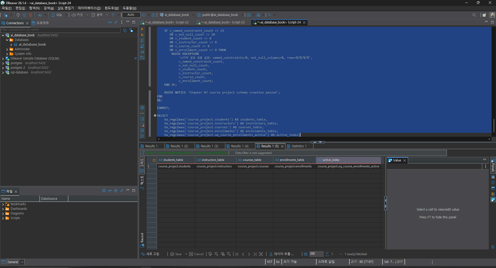
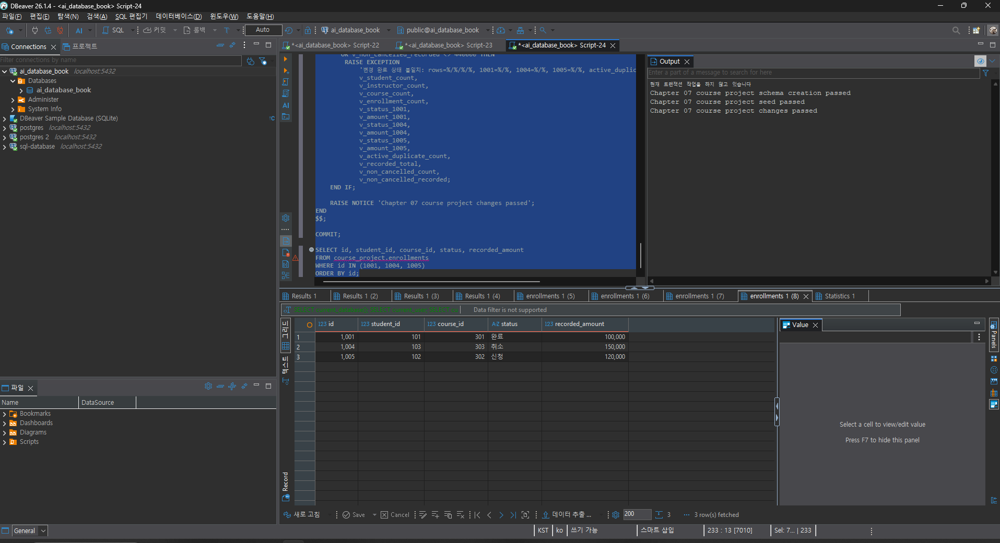
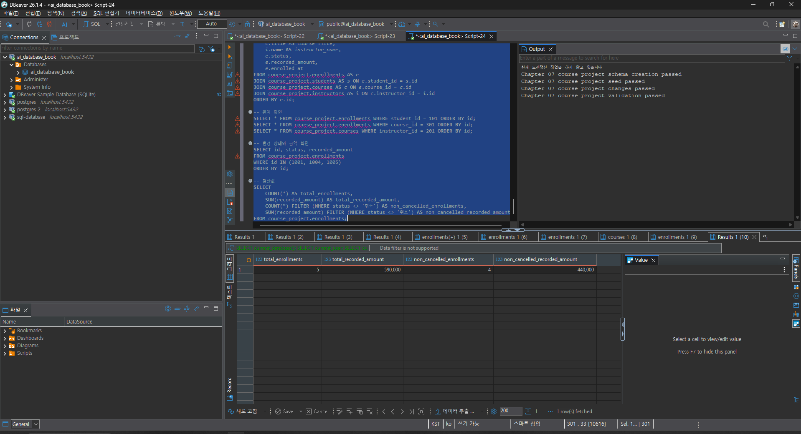
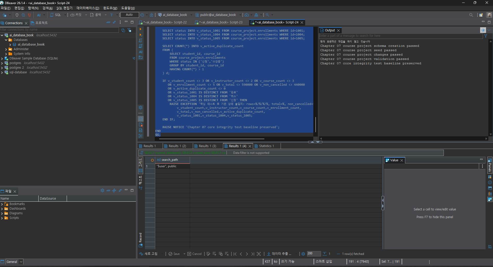
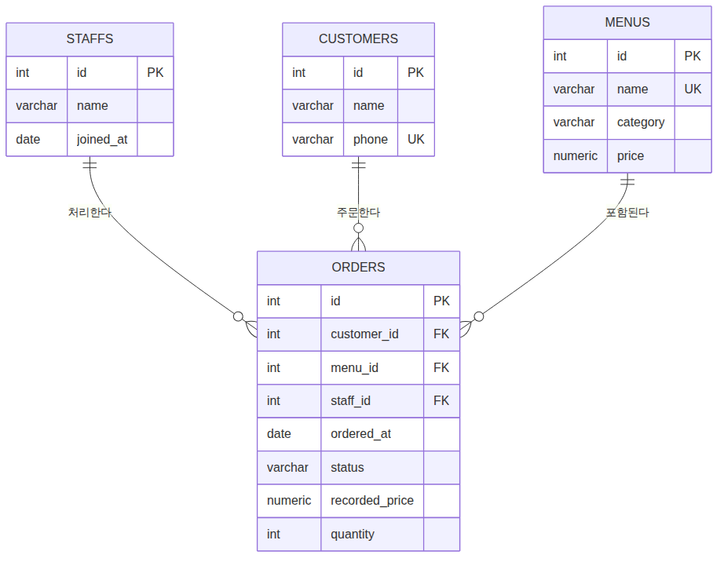

# Chapter 07 확장 실습 답안 템플릿

> **과제:** 실전 프로젝트 1 — 온라인 강의 수강신청 DB 완성하기  
> **사용 방법:** 이 파일을 내려받아 본인의 GitHub 저장소에 `chapter07_answer.md`라는 이름으로 저장한 뒤 실습하면서 바로 작성합니다.  
> **제출 방법:** LMS에는 파일을 직접 업로드하지 않고, **본인 GitHub 저장소의 `chapter07_answer.md` 파일 URL**을 제출합니다.

---

## 제출 전 주의

이 파일과 캡처 화면에는 실제 비밀번호, 전체 DB 접속 URL, API Key, 개인정보를 기록하지 않습니다.

```text
GitHub 계정 또는 별칭:candle1030
과제 작성일:2026-09-15
사용한 AI 도구:클로드
```

---

# 1. 시작 환경 확인

다음을 실행합니다.

```sql
SELECT current_database();
SELECT current_user;
SELECT current_schema();
SHOW search_path;
SHOW transaction_read_only;
```

| 확인 항목 | 실제 결과 | 의미 |
| --- | --- | --- |
| `current_database()` | ai_database_book | 이 프로젝트 전용으로 지정된 DB에 접속했는지 확인하는 값 |
| `current_user` | postgres | 지금 이 DB에 어떤 권한으로 접속해 있는지 |
| `current_schema()` | public | 스키마 |
| `search_path` | "$user", public | 스키마 이름을 생략했을 때 탐색되는 순서 |
| `transaction_read_only` | off | 쓰기가 가능 여부 |

- [x] 현재 DB가 `ai_database_book`이다.
- [x] 쓰기 가능한 연결인지 확인했다.
- [x] 실행할 SQL 범위를 확인했다.
- [x] Auto-commit 상태를 확인했다.

### 프로젝트 SQL을 실행하기 전에 시작 상태를 확인해야 하는 이유

```text
스키마 생성이나 Seed 입력 같은 SQL은 되돌리기 어려운 변경을 만든다. 만약 잘못된 데이터베이스나
읽기 전용 연결에서 실행하면 의도한 프로젝트가 아닌 곳에 데이터가 쌓이거나, 실행 자체가 중간에
막혀 스키마·시드·검증 파일 사이에 상태 불일치가 생길 수 있다. 그래서 SQL을 실행하기 전에
어떤 데이터베이스에, 어떤 권한으로, 어떤 스키마 범위에 접속해 있는지 먼저 확인하는 것이
전체 실습의 전제 조건이 된다.
```

---

# 2. 프로젝트 범위와 요구사항 읽기

## 2-1. 포함 범위

본문을 그대로 복사하지 말고 자신의 말로 정리합니다.

```text
1. 학생 정보 관리 (이름, 이메일 등 기본 정보)
2. 강사 정보 관리 및 강사-강의 담당 관계
3. 강의 개설 정보와 강의 기준 가격
4. 학생의 수강신청(신청/수강중/완료/취소)과 신청 당시 금액 기록
```

## 2-2. 제외 범위

```text
1. 실제 결제 승인·실패·환불 처리
2. 강의 정원 제한과 대기열 관리
3. 상태 변경의 전체 이력(누가 언제 어떤 상태로 바꿨는지) 저장
4. 진도율, 수료 여부, 강의 콘텐츠, 쿠폰/할인 이력
```

### 범위를 명확하게 정해야 하는 이유

```text
기능을 무한정 추가할 수는 없기 때문에, 이번 버전에서 무엇을 검증 대상으로 삼고 무엇은
다루지 않을지 먼저 선을 그어야 한다. 포함 범위가 명확해야 요구사항과 제약조건을 정확히
설계할 수 있고, 제외 범위가 명확해야 나중에 "왜 결제 테이블이 없는가" 같은 질문에
설계 실수가 아니라 의도된 범위 밖이라고 답할 수 있다.
```

## 2-3. 요구사항 / 프로젝트 결정 / 미확정 질문 구분

아래 항목 중 대표 항목을 정리합니다.

| ID | 종류 | 내용 요약 | DB 구조/규칙에 미치는 영향 |
| --- | --- | --- | --- |
| P07-R01 | 요구사항 | 학생은 이름과 이메일을 반드시 가진다 | students.name, email에 NOT NULL 제약 |
| P07-R05 | 요구사항 | 학생 이메일은 학생 테이블 안에서 유일해야 한다 | students.email에 UNIQUE 제약 |
| P07-R07 | 요구사항 | 강의 가격과 신청 기록 금액은 음수일 수 없다 | courses.price, enrollments.recorded_amount에 CHECK (>= 0) |
| P07-D02 | 프로젝트 결정 | 상태 변경 이력은 별도 테이블로 남기지 않고 현재 상태만 UPDATE로 관리한다 | 이력 테이블 없음, enrollments.status만 갱신 |
| P07-D03 | 프로젝트 결정 | 진행 중(신청/수강중) 상태의 중복 신청은 허용하지 않는다 | uq_course_enrollments_active 부분 고유 인덱스로 구현 |
| P07-Q01 | 미확정 질문 | 학생과 강사 사이에서도 이메일을 전역 고유하게 제한할 것인가? | 아직 제약조건으로 만들지 않음 (정책 확인 필요) |

### 미확정 질문을 바로 제약조건으로 만들면 안 되는 이유

```text
미확정 질문은 아직 비즈니스 정책이 결정되지 않은 영역이다. 예를 들어 이메일을 학생·강사
전체에서 전역 고유로 만들면, 나중에 실제로는 같은 사람이 학생이면서 강사일 수 있다는
정책이 확정될 경우 이미 만든 UNIQUE 제약이 오히려 데이터 입력을 막는 장애물이 된다.
DB 제약조건은 한 번 걸면 되돌리기 번거로우므로, 확정된 요구사항과 프로젝트 결정만
제약조건으로 만들고 미확정 질문은 질문인 채로 남겨서 나중에 근거를 가지고 결정해야 한다.
```

---

# 3. 네 테이블의 한 행 의미와 관계

## 3-1. 한 행 의미

```text
course_project.students 한 행 = 학생 한 명의 등록 정보

course_project.instructors 한 행 = 강사 한 명의 등록 정보

course_project.courses 한 행 = 개설된 강의 한 개 (제목, 가격, 난이도, 담당 강사 포함)

course_project.enrollments 한 행 = 특정 학생이 특정 강의를 신청한 사건 한 건
(신청 시각, 상태, 신청 당시 금액을 함께 갖는다)
```

## 3-2. 키와 중요 규칙

| 테이블 | PK | FK | 중요 규칙 |
| --- | --- | --- | --- |
| students | id | 없음 | email UNIQUE, name/email NOT NULL |
| instructors | id | 없음 | email UNIQUE, name/email NOT NULL |
| courses | id | instructor_id → instructors.id | 	price >= 0, 난이도는 허용된 값 중 하나 |
| enrollments | id | student_id → students.id, course_id → courses.id | status는 허용된 값 중 하나, recorded_amount >= 0, 활성 상태 중복 신청 금지(부분 고유 인덱스) |

## 3-3. 관계를 양방향 문장으로 작성

```text
instructors ↔ courses:
한 강사는 0개 이상의 강의를 담당할 수 있고, 한 강의는 정확히 한 명의 강사를 참조한다.

students ↔ enrollments:
한 학생은 0개 이상의 수강신청을 가질 수 있고, 한 수강신청은 정확히 한 명의 학생을 참조한다.

courses ↔ enrollments:
한 강의는 0개 이상의 수강신청을 가질 수 있고, 한 수강신청은 정확히 한 개의 강의를 참조한다.
```

### 학생과 강의의 N:M 관계가 `enrollments`를 통해 어떻게 바뀌는지 설명

```text
학생 한 명이 여러 강의를 들을 수 있고, 강의 하나에 여러 학생이 신청할 수 있으므로
학생과 강의는 원래 N:M 관계다. 관계형 DB는 N:M을 직접 표현하지 못하므로,
enrollments 테이블이 학생 1:N, 강의 1:N 관계로 각각 연결되면서 그 사이를 풀어준다.
즉 students 1 ── N enrollments N ── 1 courses 구조로 N:M이 두 개의 1:N 관계로 바뀐다.
```

### `enrollments`가 단순 연결 테이블이 아니라 사건 테이블이라고 볼 수 있는 이유

```text
단순 연결 테이블이라면 student_id와 course_id 두 개의 FK만 있으면 된다. 하지만
enrollments는 그 외에도 enrolled_at(언제 신청했는가), status(지금 어떤 상태인가),
recorded_amount(그 시점에 얼마로 기록됐는가)라는 독립적인 속성을 갖는다.
이는 "학생과 강의가 연결되어 있다"는 사실보다 "학생이 강의를 신청한 사건이 일어났고,
그 사건은 고유한 상태와 값을 가진다"는 의미에 더 가깝다.
```

---

# 4. `recorded_amount`의 의미 이해

```text
courses.price = 현재 시점 기준으로 이 강의를 신청하면 적용되는 가격 (강의 자체의 속성)

enrollments.recorded_amount = 그 학생이 그 강의를 신청한 "그 순간"에 기록해 둔 금액
(신청 사건 자체의 속성)
```

### 두 값이 처음에는 같아도 같은 의미가 아닌 이유

```text
현재 프로젝트에는 할인 기능이 없어서 신규 신청 시 courses.price를 그대로 복사하기 때문에
처음에는 두 값이 같다. 하지만 courses.price는 강사가 나중에 강의 가격을 인상하거나
인하하면 바뀔 수 있는 "현재 기준값"이고, enrollments.recorded_amount는 신청이 일어난
그 시점에 이미 확정되어 이후 가격이 바뀌어도 변하지 않는 "과거 기록값"이다.
즉 하나는 계속 변할 수 있는 기준, 하나는 특정 시점에 고정된 사실이다.
```

### `recorded_amount`를 실제 결제 성공액이나 회계 매출로 해석하면 안 되는 이유

```text
이번 프로젝트 범위에는 결제 승인/실패/환불 기능이 빠져 있다. recorded_amount는
"신청이 생성될 때 기록해 둔 금액"일 뿐, 실제로 결제가 성공했는지, 이후 환불되었는지는
반영하지 않는다. 예를 들어 상태가 '취소'로 바뀌어도 recorded_amount는 그대로 남아있을 수
있으므로, 이 값을 그대로 매출로 집계하면 취소된 신청까지 매출에 포함되는 오류가 생긴다.
실제 매출/결제액을 계산하려면 상태(취소 제외 여부)까지 함께 고려해야 한다.
```

---

# 5. STEP 01 — 스키마와 테이블 생성

실행 파일:

```text
chapter07/01_course_project_schema.sql
```

## 5-1. 실행 전 예상

```text
course_project 스키마 존재 여부: 없음 (이번 실행으로 새로 생성됨)
예상 테이블 수: 4개 (students, instructors, courses, enrollments)
예상 데이터 행 수: 0행 (네 테이블 모두)
예상되는 명명 제약조건 수: 15개
예상되는 NOT NULL 열 수: 20개
부분 고유 인덱스 존재 여부: uq_course_enrollments_active 존재 (진행 중 상태 중복 신청 방지용)
```

## 5-2. 실행 결과

```text
실제 테이블 수: 4개
실제 명명 제약조건 수: 15개
실제 NOT NULL 열 수: 20개
부분 고유 인덱스: uq_course_enrollments_active 존재
네 테이블의 실제 행 수: students 0 / instructors 0 / courses 0 / enrollments 0
통과 메시지: Chapter 07 course project schema creation passed
```

### 예상과 실제 비교

```text
스크립트 안에 자체 검증 로직(DO 블록)이 들어있어서, 제약조건 수·NOT NULL 수·행 수가 기대값과
정확히 일치해야만 통과 메시지가 출력된다. 즉 예상과 실제가 다르면 통과 메시지 자체가 뜨지
않으므로, 통과 메시지가 떴다는 것 자체가 예상과 실제가 일치했다는 증거가 된다.
```

### 증거 화면

권장 경로:

```text
assignments/ch07/image/step05_schema.png
```


---

# 6. STEP 02 — Seed 데이터 입력

실행 파일:

```text
chapter07/02_course_project_seed.sql
```

## 6-1. 실행 전 예상

```text
students: 3
instructors: 2
courses: 3
enrollments: 4
recorded_amount 합계: 470000
학생 101 신청 건수: 2
강의 301 신청 건수: 2
강사 201 담당 강의 수: 2
활성 중복 신청: 0
```

## 6-2. 실제 결과

```text
students: 3
instructors: 2
courses: 3
enrollments: 4
recorded_amount 합계: 470000
학생 101 신청 건수: 2
강의 301 신청 건수: 2
강사 201 담당 강의 수: 2
활성 중복 신청: 0
1001 상태: 수강중
1004 상태: 신청
1005 존재 여부: 없음
통과 메시지: Chapter 07 course project seed passed
```

### Seed 데이터를 단순 예제가 아니라 검증 데이터라고 볼 수 있는 이유

```text
Seed 데이터는 화면을 채우기 위한 예시가 아니라, 이후 단계에서 나올 결과와 비교할 수 있는
"기준점"이다. 한 학생이 여러 강의를 신청한 경우(학생 101), 한 강의에 여러 학생이 신청한
경우(강의 301), 한 강사가 여러 강의를 담당하는 경우(강사 201), 서로 다른 상태(신청/수강중)가
공존하는 경우를 의도적으로 포함시켜서, 이후 변경·검증 SQL이 1:N 관계와 상태 값을 제대로
처리하는지 확인할 수 있게 만든 데이터다.
```

---

# 7. STEP 03 — 변경 시나리오 실행

실행 파일:

```text
chapter07/03_course_project_changes.sql
```

## 7-1. 실행 전에 상태 변화를 예상

| 신청 ID | 변경 전 예상 상태 | 변경 후 예상 상태 | 예상 recorded_amount |
| ---: | --- | --- | ---: |
| 1001 | 수강중 | 완료 | 100000 |
| 1004 | 신청 | 취소 | 150000 |
| 1005 | (존재하지 않음, 신규 생성) | 신청 | 120000 |

```text
변경 후 예상 enrollments 행 수: 5
변경 후 예상 전체 recorded_amount 합계: 590000
변경 후 예상 취소 제외 건수: 4
변경 후 예상 취소 제외 recorded_amount 합계: 440000
```

## 7-2. 실제 결과

```text
1001 상태 / recorded_amount: 완료 / 100000
1004 상태 / recorded_amount: 취소 / 150000
1005 상태 / recorded_amount: 신청 / 120000
최종 enrollments 행 수: 5
전체 recorded_amount 합계: 590000
취소 제외 건수: 4
취소 제외 recorded_amount 합계: 440000
활성 중복 신청: 0
통과 메시지: Chapter 07 course project changes passed
```

### 조건부 UPDATE에서 예상 이전 상태를 확인해야 하는 이유

```text
"1001을 완료로 바꾼다"처럼 결과만 지정하는 UPDATE는, 그 사이 다른 작업이 이미 1001을
다른 상태로 바꿔놓았을 경우 그 변경 내용을 인지하지 못한 채 덮어써 버린다. 반면
"1001이 예상한 이전 상태(수강중)일 때만 완료로 바꾼다"처럼 조건을 거는 UPDATE는, 예상과
다른 상태라면 아예 아무 것도 바꾸지 않기 때문에 데이터 유실이나 의도치 않은 덮어쓰기를
막을 수 있다. 이는 이후 Chapter 09에서 배우는 트랜잭션·동시성 문제의 기초가 되는 습관이다.
```

### 증거 화면

권장 경로:

```text
assignments/ch07/image/step07_changes.png
```


---

# 8. STEP 04 — 최종 완료 게이트 실행

실행 파일:

```text
chapter07/04_course_project_validation.sql
```

## 8-1. 최종 검증 결과

```text
최종 행 수 students/instructors/courses/enrollments: 3 / 2 / 3 / 5
서비스 JOIN 결과 행 수: 5
학생 101 신청 수: 2
강의 301 신청 수: 2
강사 201 강의 수: 2
고아 관계 수: 0
활성 중복 신청 수: 0
전체 recorded_amount: 590000
취소 제외 recorded_amount: 440000
통과 메시지: Chapter 07 course project validation passed
```

### SQL 파일 4개가 모두 실행되었다는 사실과 프로젝트 검증 PASS가 다른 이유

```text
01~04 파일이 오류 없이 끝까지 실행됐다는 것은 "중간에 멈추지 않았다"는 뜻일 뿐이다.
반면 04번 validation 파일은 행 수, 관계, 금액, 중복 여부 등 프로젝트가 원래 만족해야 할
모든 조건을 하나하나 검사해서, 조건 중 하나라도 어긋나면 실패로 처리한다. 즉 "실행이
끝났다"와 "요구사항을 실제로 만족한다"는 서로 다른 질문이고, 후자를 확인하는 것이
validation 파일의 역할이다.
```

### 증거 화면

권장 경로:

```text
assignments/ch07/image/step08_validation.png
```


---

# 9. 무결성 테스트

실행 파일:

```text
chapter07/05_course_project_integrity_tests.sql
```

> 오류 테스트는 파일 전체를 무작정 실행하지 않고 **한 테스트 구간씩** 실행합니다.

## 9-1. 허용되어야 하는 경계값 1개

```text
테스트 내용: 강의 가격 0원(무료 강의), description NULL, 신청 기록 금액 0원인 신청을 만들어본다
기대 결과: 세 값 모두 정상적으로 INSERT 성공해야 한다
실제 결과: 오류 없이 성공, 이후 DELETE로 임시 행 정리 완료
왜 허용되어야 하는가: price·recorded_amount의 CHECK 제약은 ">= 0"이지 "> 0"이 아니므로 0은
유효한 값이다. description도 NOT NULL이 아니므로 NULL이 정상 허용된다.
```

## 9-2. 실패해야 하는 테스트 1 — 잘못된 참조 또는 값

```text
테스트 내용: enrollments.status에 허용되지 않은 값('대기')을 넣어본다
기대 결과: INSERT가 오류로 실패해야 한다
실제 오류 핵심: new row for relation "enrollments" violates check constraint "chk_course_enrollments_status"
동작한 제약조건/규칙: chk_course_enrollments_status
왜 실패해야 하는가: P07-R06 요구사항(상태는 신청/수강중/완료/취소 중 하나)을 어기는 값이므로,
DB가 거부해야 잘못된 상태값이 들어가는 것을 막을 수 있다.
```

## 9-3. 실패해야 하는 테스트 2 — 활성 중복 신청

```text
테스트 내용: 이미 학생 101이 강의 302에 '신청' 상태로 활성 신청(1002)이 있는데, 같은
학생·강의 조합으로 '수강중' 상태의 신청을 또 넣어본다
기대 결과: INSERT가 오류로 실패해야 한다
실제 오류 핵심: duplicate key value violates unique constraint "uq_course_enrollments_active"
동작한 인덱스/규칙: uq_course_enrollments_active (부분 고유 인덱스)
왜 실패해야 하는가: P07-D03 결정(진행 중 중복 신청은 허용하지 않는다)에 따라, 같은 학생이
같은 강의를 동시에 두 번 활성 상태로 신청하는 것은 막아야 하는 비즈니스 규칙 위반이다.
```

## 9-4. 실패 후 기준 상태 재검증

```text
04 validation 재실행 결과: Chapter 07 course project validation passed (그대로 통과)
기준 데이터가 유지되었는가: 예 — 실패한 INSERT들은 커밋되지 않았으므로 3/2/3/5행,
전체 590000 / 취소 제외 440000 등 기준 상태가 그대로 보존됨.
파일 자체의 재검증 메시지도 확인: Chapter 07 core integrity test baseline preserved
```

### 실패 테스트가 프로젝트 품질 검증에 필요한 이유

```text
정상 데이터만 넣어보고 통과했다고 해서 설계가 안전하다고 말할 수는 없다. 오히려 "이 데이터는
반드시 거부되어야 한다"고 정한 값(중복 활성 신청, 존재하지 않는 참조, 허용되지 않은 상태값 등)을
일부러 넣어보고 실제로 거부되는지 확인해야, 제약조건이 이름만 있는 게 아니라 실제로 작동하고
있다는 것을 증명할 수 있다. 실패해야 할 때 실패하지 않는 것도, 성공해야 할 때 실패하는 것만큼
심각한 설계 결함이다.
```

### 증거 화면

권장 경로:

```text
assignments/ch07/image/step09_integrity.png
```


---

# 10. 재현성 실험

```text
수행 여부: 선택 단계로, 본 실습에서는 수행하지 않음 (기존 실습 데이터 보존을 위해 생략)
```

### 다른 사람이 같은 순서로 실행해 같은 결과를 얻는 것이 중요한 이유

```text
내 컴퓨터에서만 우연히 동작하는 스크립트는 프로젝트로서 신뢰하기 어렵다. reset부터 다시 실행해도
매번 같은 스키마, 같은 기준 데이터, 같은 검증 결과가 나와야 다른 사람(또는 미래의 나)이 그대로
따라 했을 때 같은 결론에 도달할 수 있고, 이는 이 프로젝트가 "우연히 된 것"이 아니라 "설계와
순서가 명확한 것"임을 보여주는 증거가 된다.
```

---

# 11. Chapter 01~06 개인 프로젝트를 중간 프로젝트 초안으로 확장

## 11-1. 프로젝트 기본 정보

```text
프로젝트 이름: 카페 주문·메뉴 관리 DB

해결하려는 문제: 카페에서 어떤 손님이 언제 어떤 메뉴를 얼마에 주문했는지, 주문이 지금
어떤 처리 단계에 있는지를 정확히 기록하고 검증할 수 있는 데이터베이스가 필요하다.

주요 사용자: 카페 사장 및 직원 (메뉴 등록, 주문 접수·처리 상태 관리)
```

## 11-2. 포함 범위 / 제외 범위

```text
[포함]
1. 고객(손님) 정보 관리
2. 메뉴 정보 관리 (이름, 가격, 카테고리)
3. 직원 정보와 담당 주문 관계
4. 주문 접수와 처리 상태(접수/제조중/완료/취소), 주문 당시 가격 기록

[제외]
1. 실제 결제 수단(카드/현금) 처리와 승인
2. 원두·우유 등 원재료 재고 관리
3. 쿠폰·포인트·할인 시스템
4. 매장 좌석/테이블 예약
```

## 11-3. 요구사항

| ID | 요구사항 | 관련 테이블/관계 | 검증 방법 후보 |
| --- | --- | --- | --- |
| P07-MR01 | 고객은 이름과 전화번호를 가진다 | customers | NOT NULL 확인 |
| P07-MR02 | 전화번호는 고객 테이블 내에서 유일해야 한다 | customers | UNIQUE 제약 확인 |
| P07-MR03 | 메뉴는 이름, 가격, 카테고리를 가지며 가격은 0 이상이어야 한다 | menus | NOT NULL + CHECK(price>=0) |
| P07-MR04 | 메뉴 이름은 메뉴 테이블 내에서 유일해야 한다 | menus | UNIQUE 제약 확인 |
| P07-MR05 | 직원은 이름과 입사일을 가진다 | staffs | NOT NULL 확인 |
| P07-MR06 | 모든 주문은 반드시 존재하는 고객·메뉴·담당 직원을 참조해야 한다 | orders → customers/menus/staffs | FK 위반 시 오류 테스트 |
| P07-MR07 | 주문 상태는 접수/제조중/완료/취소 중 하나다 | orders.status | CHECK 제약, 잘못된 값 입력 테스트 |
| P07-MR08 | 주문 시 기록되는 가격과 수량은 0 이상이어야 한다 | orders.recorded_price, quantity | CHECK 제약 확인 |

## 11-4. 프로젝트 결정

| ID | 이번 프로젝트에서 내린 결정 | 이유 | 구현 후보 |
| --- | --- | --- | --- |
| P07-MD01 | 주문 시점의 menus.price를 orders.recorded_price로 복사해 기록한다 | 이후 메뉴 가격이 바뀌어도 과거 주문 금액이 변하지 않아야 함 | INSERT 시 서브쿼리로 현재 가격 복사 |
| P07-MD02 | 취소된 주문은 삭제하지 않고 상태만 '취소'로 남긴다 | 주문 이력을 보존해 취소율 등을 분석할 수 있어야 함 | UPDATE status만 변경, DELETE 금지 |
| P07-MD03 | 같은 고객이 같은 메뉴를 '접수'/'제조중' 상태로 동시에 중복 주문하는 것은 허용하지 않는다 | 실수로 같은 주문이 중복 접수되는 것을 방지 | 부분 고유 인덱스 |

## 11-5. 미확정 질문

```text
P07-MQ01. 메뉴가 일시 품절됐을 때 이를 별도 컬럼(예: is_available)으로 관리할 것인가?
P07-MQ02. 담당 직원이 퇴사하면 그 직원이 처리했던 과거 주문 기록은 어떻게 처리할 것인가?
P07-MQ03. 한 고객이 한 번에 여러 메뉴를 담아 주문하는 "장바구니" 개념을 이번 버전에서 지원할 것인가, 아니면 메뉴 하나당 주문 한 건으로 단순화할 것인가?
```

---

# 12. 개인 프로젝트 ERD와 한 행 의미

## 12-1. 테이블 후보

| 테이블 | 한 행의 의미 | PK 후보 | FK 후보 | 주요 규칙 |
| --- | --- | --- | --- | --- |
| customers | 고객 한 명 | id | 없음 | phone UNIQUE, name/phone NOT NULL |
| staffs | 직원 한 명 | id | 없음 | name NOT NULL |
| menus | 판매 중인 메뉴 한 개 | id | 없음 | name UNIQUE, price >= 0 |
| orders | 특정 고객이 특정 메뉴를 주문한 사건 한 건 | id | customer_id→customers.id, menu_id→menus.id, staff_id→staffs.id | status 허용값 중 하나, recorded_price/quantity >= 0, 활성 중복 방지 부분 인덱스 |

## 12-2. 관계 문장

```text
1. 한 직원은 0개 이상의 주문을 처리할 수 있고, 한 주문은 정확히 한 명의 담당 직원을 참조한다.
2. 한 고객은 0개 이상의 주문을 가질 수 있고, 한 주문은 정확히 한 명의 고객을 참조한다.
3. 한 메뉴는 0개 이상의 주문에 포함될 수 있고, 한 주문은 정확히 한 개의 메뉴를 참조한다.
```

## 12-3. ERD

```text
assignments/ch07/image/personal_project_erd.png
```




### Chapter 05~06 ERD에서 이번에 바꾼 점

```text
이전 Chapter에서는 아직 구체적인 개인 프로젝트 주제를 정하지 않았기 때문에, 이번 Chapter 07에서
온라인 강의 수강신청 프로젝트의 구조(독립 엔터티 2개 + 사건 테이블 1개 + 1:N 관계)를 참고해
카페 주제로 새로 설계했다. 특히 "신청 당시 금액을 사건 테이블에 기록한다"는 아이디어를
"주문 당시 가격을 orders.recorded_price에 기록한다"로 그대로 응용했다.
```

---

# 13. 개인 프로젝트 완료 기준 만들기

| 번호 | 완료 기준 | 자동 SQL 검증 가능? | 검증 방법 |
| ---: | --- | --- | --- |
| 1 | customers/staffs/menus/orders 4개 테이블이 정확히 존재한다 | 가능 | information_schema.tables 조회 |
| 2 | Seed 실행 후 각 테이블 행 수가 예상값과 같다 | 가능 | COUNT(*) 비교 |
| 3 | 존재하지 않는 고객·메뉴·직원을 참조하는 주문(고아 FK)이 0건이다 | 가능 | LEFT JOIN 후 NULL 확인 |
| 4 | 허용되지 않은 주문 상태 값 입력은 DB가 거부한다 | 가능 | 잘못된 값 INSERT 시도 → 오류 확인 |
| 5 | 같은 고객·메뉴 조합의 활성(접수/제조중) 중복 주문이 0건이다 | 가능 | 부분 고유 인덱스 위반 테스트 |
| 6 | 취소된 주문도 recorded_price가 보존되어, 전체 매출과 취소 제외 매출을 각각 계산할 수 있다 | 가능 (계산은 SQL) / 의미 설명은 사람 검토 | SUM(recorded_price), 취소 제외 SUM 비교 |

---

# 14. AI를 프로젝트 리뷰어로 사용

## 14-1. AI에게 전달한 핵심 자료

```text
요구사항: P07-MR01~08 (11-3 표)
테이블/ERD 설명: customers/staffs/menus/orders 4개 테이블 (12-1 표, 12-2 관계 문장)
프로젝트 결정: P07-MD01~03 (11-4 표)
미확정 질문: P07-MQ01~03 (11-5)
완료 기준: 13번 표 6개 항목
```

## 14-2. 내가 사용한 프롬프트

```text
나는 데이터베이스 입문 수업의 중간 프로젝트 초안을 작성하고 있습니다.
아래 프로젝트를 대신 완성하지 말고 리뷰어로 검토해 주세요.
특히 요구사항과 ERD가 연결되지 않는 부분, 한 행의 의미가 섞인 테이블, 빠진 PK/FK 관계 후보,
근거 없이 추가한 UNIQUE/NOT NULL/CHECK/CASCADE, 미확정 정책을 임의로 확정한 부분,
Seed 데이터로 검증하기 어려운 요구사항, 모호해서 자동 검증할 수 없는 완료 기준을 찾아주세요.
정답 ERD나 전체 SQL을 먼저 작성하지 말고, 문제점과 확인 질문을 우선순위 순으로 알려 주세요.
```

## 14-3. AI 제안 검토

| AI 제안 | 수용 / 수정 / 보류 / 거절 | 실제 근거 | 반영 내용 |
| --- | --- | --- | --- |
| orders 테이블에 quantity(수량) 컬럼을 추가해 CHECK(quantity>0) 걸기 | 수용 | 메뉴 1개만 주문하는 구조라도 수량 개념은 자연스럽고 학습 범위 안에서 검증 가능함 | 12-1 테이블 규칙에 반영 |
| 메뉴 카테고리를 별도 categories 테이블로 분리(FK 참조) | 보류 | 방향은 맞지만 테이블 수가 늘어나고 이번 학습 범위(4테이블 최소 요건)를 넘어서므로, 이번 버전은 menus.category를 단순 문자열로 유지 | 반영하지 않음, 차기 버전 후보로 기록 |
| 주문 취소 시 소프트 삭제(deleted_at) 컬럼 추가 | 거절 | 이미 status='취소'로 상태를 보존하는 방식(P07-MD02)을 택했으므로 소프트 삭제 컬럼은 중복 설계이며 현재 범위에 불필요 | 반영하지 않음 |
| 직원 테이블에 CASCADE 삭제 적용(직원 삭제 시 관련 주문도 삭제) | 거절 | 주문 이력은 보존해야 하는 사건 데이터이므로 CASCADE 삭제는 매출/이력 데이터를 손실시킬 위험이 큼 | RESTRICT 유지, 대신 P07-MQ02로 남겨둠 |

### AI가 미확정 정책을 임의로 확정하려 한 부분이 있었나요?

```text
있었다. AI는 처음에 "퇴사한 직원은 주문 기록에서 CASCADE로 함께 삭제하는 것이 깔끔하다"고
제안했는데, 이는 아직 결정하지 않은 정책(P07-MQ02)을 임의로 확정하려 한 것이라 거절하고
계속 미확정 질문으로 남겨두었다.
```

### AI가 제안한 규칙 중 아직 배우지 않은 기능이라 보류한 것이 있나요?

```text
있었다. 메뉴 카테고리를 별도 테이블(categories)로 정규화하자는 제안은 정규화 원칙상 타당하지만,
현재 학습 범위에서 요구하는 최소 4테이블 구조를 넘어서는 확장이라 이번 버전에서는 보류하고
문자열 컬럼으로 단순화했다.
```

### AI 활용 후 실제로 좋아진 부분

```text
처음에는 orders 테이블에 수량 개념을 빼먹고 있었는데, AI 리뷰를 통해 "메뉴 하나를 여러 개
주문하는 경우"를 누락했다는 걸 발견해서 quantity 컬럼과 CHECK 제약을 추가했다. 또한 CASCADE
삭제처럼 그럴듯해 보이지만 사건 데이터를 훼손할 수 있는 제안을 걸러내는 연습이 됐다.
```

---

# 15. 최종 성찰

```text
1. 데이터베이스 프로젝트가 완료되었다고 판단하려면
   SQL 파일의 존재보다 그 SQL이 요구사항을 실제로 만족하는지 자동으로 검증한 결과가 이다.

2. Seed 데이터의 목적은 단순히 화면을 채우는 것이 아니라
   1:N 관계, 여러 상태 값, 금액 검산 등을 실제로 확인할 수 있는 기준 데이터를 만드는 것이다.

3. 실패 테스트가 필요한 이유는
   정상 데이터만으로는 제약조건이 실제로 작동하는지 증명할 수 없고, 거부되어야 할 데이터가
   정말로 거부되는지 확인해야 설계의 안전성을 증명할 수 있기 때문이다.

4. 요구사항과 프로젝트 결정을 구분해야 하는 이유는
   반드시 지켜야 할 것과 이번 버전에서 선택적으로 정한 것을 섞으면, 나중에 정책이 바뀌었을 때
   무엇을 반드시 유지하고 무엇을 수정해도 되는지 판단하기 어려워지기 때문이다.

5. 내가 만든 개인 프로젝트에서 가장 먼저 추가 확인해야 할 정책은
   P07-MQ03(한 고객이 여러 메뉴를 한 번에 주문하는 장바구니 구조를 지원할지 여부)이다.
```

---

# 16. 제출 체크리스트

- [x] `chapter07_answer.md`를 본인 저장소에 만들었다.
- [x] 시작 환경과 현재 DB를 확인했다.
- [x] 프로젝트 포함/제외 범위를 설명했다.
- [x] 요구사항/결정/미확정 질문을 구분했다.
- [x] 네 테이블의 한 행 의미와 관계를 설명했다.
- [x] `01_course_project_schema.sql`을 실행하고 결과를 확인했다.
- [x] `02_course_project_seed.sql`의 기준 상태를 확인했다.
- [x] `03_course_project_changes.sql` 전후 상태를 비교했다.
- [x] `04_course_project_validation.sql` PASS를 확인했다.
- [x] 허용 경계값 1개 이상을 확인했다.
- [x] 실패 테스트 2개 이상을 한 구간씩 실행했다.
- [x] 실패 후 validation을 다시 실행했다.
- [x] 개인 프로젝트 요구사항 8개 이상을 작성했다.
- [x] 프로젝트 결정 3개 이상과 미확정 질문 3개 이상을 작성했다.
- [x] 개인 프로젝트 ERD를 작성했다.
- [x] 검증 가능한 완료 기준 6개 이상을 작성했다.
- [x] AI 제안을 수용/수정/보류/거절로 구분했다.
- [x] 핵심 캡처는 3~4장 정도로 정리했다.
- [x] 캡처에 비밀번호나 개인정보가 없다.
- [x] GitHub 웹에서 Markdown과 이미지가 정상적으로 보인다.
- [x] 최종 파일을 commit/push했다.

---

# 17. LMS 제출 URL

```text
https://github.com/candle1030/ai-database-book/blob/main/assignments/ch07/chapter07_answer.md
```

내 제출 URL:

```text
https://github.com/candle1030/ai-database-book/blob/main/assignments/ch07/chapter07_answer.md
```