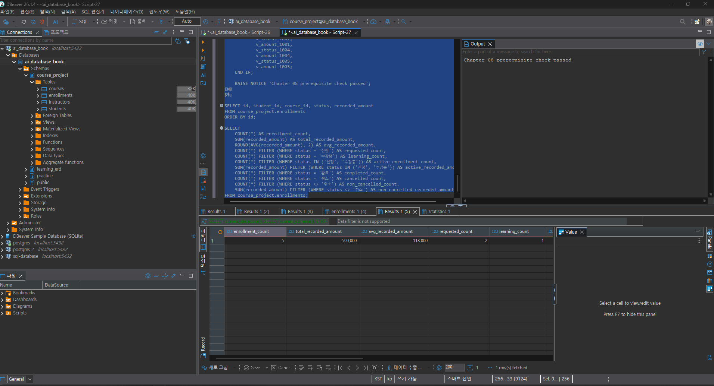
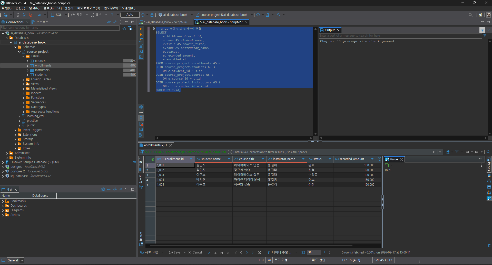
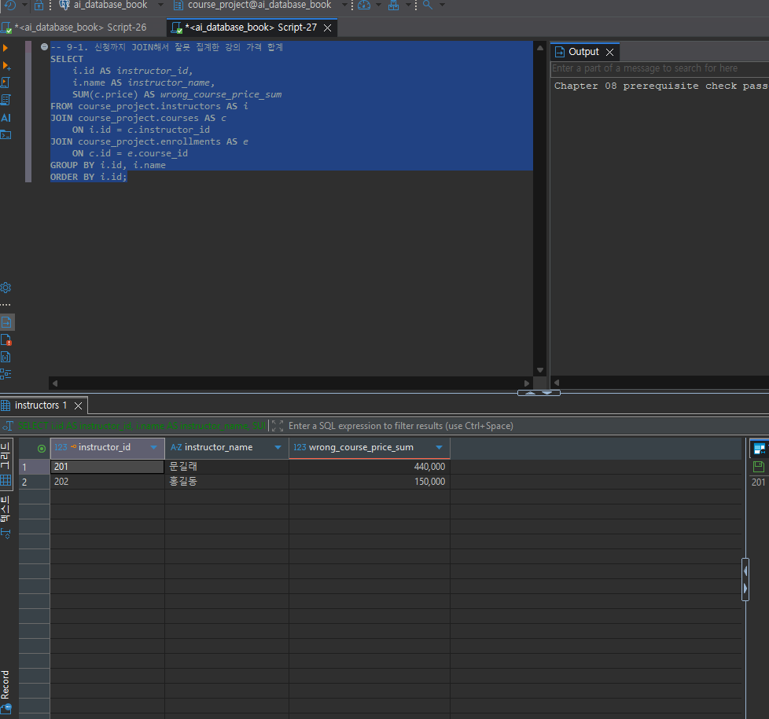

# Chapter 08 확장 실습 답안 템플릿

> **과제:** JOIN과 집계로 서비스 질문에 답하기  
> **사용 방법:** 이 파일을 내려받아 본인의 GitHub 저장소에 `chapter08_answer.md`라는 이름으로 저장한 뒤 실습하면서 바로 작성합니다.  
> **제출 방법:** LMS에는 파일을 직접 업로드하지 않고, **본인 GitHub 저장소의 `chapter08_answer.md` 파일 URL**을 제출합니다.

---

## 제출 전 주의

이 파일과 캡처 화면에는 실제 비밀번호, 전체 DB 접속 URL, API Key, 개인정보를 기록하지 않습니다.

```text
GitHub 계정 또는 별칭: candle1030
과제 작성일: 2026-09-17
사용한 AI 도구: Claude (Claude Sonnet 5, Cowork)
```

---

# 1. Chapter 07 기준 상태 확인

다음을 실행합니다.

```text
code/chapter08/00_check_course_project.sql
```

## 1-1. 사전 검사 결과

```text
검증 메시지: Chapter 08 prerequisite check passed

students 행 수: 3
instructors 행 수: 2
courses 행 수: 3
enrollments 행 수: 5

전체 신청 건수: 5
전체 recorded_amount: 590000
활성 신청 건수: 3
활성 recorded_amount: 340000
취소 제외 신청 건수: 4
취소 제외 recorded_amount: 440000
```

기준값:

```text
students = 3
instructors = 2
courses = 3
enrollments = 5

전체 = 5 / 590000
활성 = 3 / 340000
취소 제외 = 4 / 440000
```

### 기준값이 다르면 그대로 진행하면 안 되는 이유

```text
기준값이 실제 결과와 다른데도 그대로 진행하면, 이후 STEP들에서 제시되는 모든 예상값
(예: 강의 301 = 2건/200000, 강사 201 잘못된 합계 440000 vs 올바른 합계 220000 등)이
실제 데이터와 어긋나 검산 자체가 불가능해진다.

실제로 이번 실습에서 1차 실행 시 students 행 수가 3이 아니라 4로 나와 사전 검사가
실행 중단(RAISE EXCEPTION)되었다. 원인을 확인해보니, 이전에 교수님과 별도로 진행한
실습 중 course_project.students 테이블에 학생 한 명(id=104, 이름 문강, joined_at이
당일 날짜)을 직접 추가했던 것이 남아 있었기 때문이었다.

삭제 전 enrollments 테이블에 student_id=104로 연결된 신청 기록이 없음을 먼저 확인한 뒤
(고아 참조·활성 중복 위험이 없음을 검증) 해당 행을 삭제했고, 재검사에서
'Chapter 08 prerequisite check passed'가 정상 출력됨을 확인했다.
```

### 증거 화면

경로:

```text
assignments/ch08/images/step01_prerequisite.png
```



---

# 2. 업무 질문을 SQL보다 먼저 정의하기

다음 세 질문을 각각 SQL 작성 전에 먼저 정의합니다.

## 질문 A

```text
업무 질문: 신청 내역 한 건마다 학생 이름·강의명·강사 이름·상태를 함께 보고 싶다.
결과 한 행의 의미: 수강신청(enrollment) 한 건
포함 상태: 신청, 수강중, 완료, 취소 (전체 상태, 상태 필터 없음)
제외 상태: 없음 (모든 상태 포함)
JOIN할 테이블: enrollments, students, courses, instructors
JOIN 경로: enrollments.student_id → students.id / enrollments.course_id → courses.id / courses.instructor_id → instructors.id
INNER JOIN / LEFT JOIN 선택: INNER JOIN
그 이유: enrollments.student_id/course_id, courses.instructor_id는 모두 NOT NULL FK이고 00번 사전 검사에서 고아 관계가 0건임을 이미 확인했으므로, INNER JOIN을 써도 데이터 손실 없이 모든 신청을 조회할 수 있다.
예상 행 수: 5행 (enrollments 전체 건수와 동일)
```

## 질문 B

```text
업무 질문: 강의별로 취소를 제외한 실제 신청 건수, 고유 신청 학생 수, 기록 금액 합계는 얼마인가?
결과 한 행의 의미: 강의 한 개
포함 상태: 신청, 수강중, 완료
제외 상태: 취소
JOIN할 테이블: courses, enrollments
JOIN 경로: courses.id → enrollments.course_id
집계 대상: COUNT(e.id) = 취소 제외 신청 건수 / COUNT(DISTINCT e.student_id) = 고유 학생 수 / SUM(e.recorded_amount) = 취소 제외 기록 금액 합계
예상 결과: 강의 301 = 2건/2명/200000, 강의 302 = 2건/2명/240000, 강의 303 = 0건/0명/0원 (합계 440000)
```

## 질문 C

```text
업무 질문: 취소 제외 신청이 하나도 없는 강의도 빠지지 않고 전체 강의 목록에 나와야 한다.
결과 한 행의 의미: 강의 한 개 (신청 존재 여부와 무관하게 courses 기준으로 유지)
포함 상태: 신청, 수강중, 완료 (신청 쪽 상태 필터)
제외 상태: 취소
0건인 부모도 보여야 하는가: 그렇다. courses를 기준(부모)으로 LEFT JOIN해야 강의 303처럼 취소 제외 신청이 없는 강의도 결과에서 사라지지 않는다.
NULL을 어떻게 해석할 것인가: LEFT JOIN 결과에서 자식 쪽 컬럼(e.id 등)이 NULL인 것은 '데이터 없음'이지 0이 아니다. COUNT(e.id)는 NULL을 세지 않아 자연스럽게 0이 되지만, SUM(e.recorded_amount)는 대상이 없으면 NULL이 되므로 COALESCE(..., 0)으로 감싸 0원임을 명시해야 한다.
예상 결과: 강의 303 = COUNT(*) 1행(부모 행 유지) / COUNT(e.id) 0 / COUNT(DISTINCT e.student_id) 0 / recorded_amount 0원
```

---

# 3. INNER JOIN과 다중 JOIN

## 3-1. 신청 한 건마다 학생 이름과 강의 제목 조회

실행 전 예상:

```text
결과 한 행 = 수강신청 한 건
예상 행 수 = 5행
JOIN 경로 = enrollments.student_id → students.id / enrollments.course_id → courses.id
```

내가 실행한 SQL:

```sql
SELECT
    e.id AS enrollment_id,
    s.name AS student_name,
    c.title AS course_title,
    e.status
FROM course_project.enrollments AS e
INNER JOIN course_project.students AS s
    ON e.student_id = s.id
INNER JOIN course_project.courses AS c
    ON e.course_id = c.id
ORDER BY e.id;
```

실제 결과:

```text
실제 행 수: 5행
예상과 일치 여부: 일치 (5행)
```

| enrollment_id | student_name | course_title | status |
| ---: | --- | --- | --- |
| 1001 | 김민지 | 데이터베이스 입문 | 완료 |
| 1002 | 김민지 | 정규화 실습 | 신청 |
| 1003 | 이준호 | 데이터베이스 입문 | 수강중 |
| 1004 | 박서연 | 파이썬 데이터 분석 | 취소 |
| 1005 | 이준호 | 정규화 실습 | 신청 |

### 학생 이름이 여러 번 보이는 것이 중복 오류가 아닐 수 있는 이유

```text
김민지, 이준호 같은 학생 이름이 결과에 여러 번 나오는 것은 한 학생이 서로 다른 강의를 여러 건 신청했기 때문이다.
결과 한 행의 기준이 '신청 한 건'이므로, 학생 한 명이 두 건을 신청하면 그 학생 이름도 두 번 나오는 것이
1:N 관계(학생 1 : 신청 N)에서 정상적인 결과다. 여기서 DISTINCT를 임의로 적용하면 오히려 실제 신청 건수 정보가
사라지므로, 이 반복을 '중복 오류'로 보고 DISTINCT부터 넣는 것은 잘못된 접근이다.
```

## 3-2. 학생·강의·강사까지 연결

```text
결과 한 행 = 수강신청 한 건 (담당 강사 정보 포함)
강사까지 가는 JOIN 경로 = enrollments.course_id → courses.id → courses.instructor_id → instructors.id (enrollments는 instructor를 직접 참조하지 않음)
```

```sql
SELECT
    e.id AS enrollment_id,
    s.name AS student_name,
    c.title AS course_title,
    i.name AS instructor_name,
    e.status,
    e.recorded_amount,
    e.enrolled_at
FROM course_project.enrollments AS e
JOIN course_project.students AS s
    ON e.student_id = s.id
JOIN course_project.courses AS c
    ON e.course_id = c.id
JOIN course_project.instructors AS i
    ON c.instructor_id = i.id
ORDER BY e.id;
```

```text
실제 행 수: 5행

instructors는 enrollments에서 직접 참조되지 않는다. 강사 정보를 얻으려면 courses.instructor_id라는
실제 FK를 한 단계 더 거쳐야 한다(enrollments → courses → instructors). 만약 이름 같은 임의의 텍스트 컬럼으로
직접 연결하면 동명이인이나 오타가 있을 때 전혀 다른 강사와 잘못 연결될 위험이 있으므로,
반드시 PK/FK 관계(정수 id 기반)를 따라 JOIN해야 결과의 정확성이 보장된다.
```

### 증거 화면

권장 경로:

```text
assignments/ch08/images/step03_inner_join.png
```



---

# 4. LEFT JOIN과 0건 표현

## 4-1. 강의별 취소 제외 신청 수

신청이 없는 강의도 결과에 남도록 작성합니다.

실행 전:

```text
결과 한 행 = 강의 한 개
강의 303의 예상 실제 신청 수 = 0건
강의 303의 예상 고유 학생 수 = 0명
강의 303의 예상 recorded_amount = 0원
```

내 SQL:

```sql
SELECT
    c.id AS course_id,
    c.title AS course_title,
    COUNT(e.id) AS non_cancelled_count,
    COUNT(DISTINCT e.student_id) AS student_count,
    COALESCE(SUM(e.recorded_amount), 0) AS non_cancelled_recorded_amount
FROM course_project.courses AS c
LEFT JOIN course_project.enrollments AS e
    ON c.id = e.course_id
   AND e.status <> '취소'
GROUP BY c.id, c.title
ORDER BY c.id;
```

실제 결과:

```text
강의 301: 2건 / 2명 / 200,000원
강의 302: 2건 / 2명 / 240,000원
강의 303: 0건 / 0명 / 0원 (부모 행은 그대로 유지됨)
```

## 4-2. `COUNT(*)`와 `COUNT(e.id)` 비교

강의 303을 기준으로 작성합니다.

```text
COUNT(*) 결과: 1 (강의 303 기준, 부모 행 1개는 유지됨)
COUNT(e.id) 결과: 0 (실제 연결된 취소 제외 신청 없음)
COUNT(DISTINCT e.student_id) 결과: 0
```

### 왜 `COUNT(*) = 1`인데 실제 신청 수는 0일 수 있나요?

```text
LEFT JOIN에서 COUNT(*)는 JOIN 결과의 '행' 자체를 센다. 강의 303은 courses 테이블의 부모 행이므로
연결되는 자식(취소 제외 신청)이 하나도 없어도 courses 쪽 행 1개는 그대로 남는다(자식 컬럼은 전부 NULL).
그래서 COUNT(*)는 1이 되지만, 실제로 취소 제외 상태인 신청은 하나도 없으므로 '진짜 신청 수'는 0이다.
COUNT(*)는 '부모 행 존재 여부'를 세는 것이지 '자식 사건 발생 여부'를 세는 것이 아니다.
```

### 자식 사건 수를 셀 때 `COUNT(child.id)`가 더 적절한 이유

```text
COUNT(child.id)(예: COUNT(e.id))는 NULL을 세지 않는 COUNT의 특성을 이용한다. LEFT JOIN에서 자식이
없으면 그 자식 쪽 컬럼(e.id)이 NULL로 채워지는데, COUNT(e.id)는 NULL인 행을 세지 않으므로 자동으로 0이 된다.
반면 COUNT(*)는 NULL 여부와 무관하게 결과 행 수 자체를 세기 때문에 부모만 남아도 1이 될 수 있다.
따라서 '자식 사건이 실제로 몇 번 일어났는가'를 세고 싶다면 COUNT(*)가 아니라 COUNT(child.id)를 써야 한다.
```

---

# 5. `LEFT JOIN`에서 `ON`과 `WHERE` 조건 비교

취소 제외 신청만 연결한다고 가정합니다.

## 5-1. 조건을 `ON`에 둔 경우

```sql
SELECT
    s.id,
    s.name,
    COUNT(e.id) AS non_cancelled_count
FROM course_project.students AS s
LEFT JOIN course_project.enrollments AS e
    ON s.id = e.student_id
   AND e.status <> '취소'
GROUP BY s.id, s.name
ORDER BY s.id;
```

```text
결과 학생 수: 3명 (김민지, 이준호, 박서연 모두 포함)
박서연 포함 여부: 포함됨 (non_cancelled_count = 0으로 표시)
```

## 5-2. 조건을 `WHERE`에 둔 경우

```sql
SELECT
    s.id,
    s.name,
    COUNT(e.id) AS non_cancelled_count
FROM course_project.students AS s
LEFT JOIN course_project.enrollments AS e
    ON s.id = e.student_id
WHERE e.status <> '취소'
GROUP BY s.id, s.name
ORDER BY s.id;
```

```text
결과 학생 수: 2명 (김민지, 이준호만 포함)
박서연 포함 여부: 제외됨 (결과에서 사라짐)
```

## 5-3. 차이 설명

```text
ON 조건이 LEFT JOIN의 오른쪽 연결 대상을 제한하는 방식: 오른쪽 테이블(enrollments)에서 조인 시점에 어떤 행을 매칭 대상으로 삼을지 필터링한다. 조건에 맞지 않는 자식 행은 매칭에서만 제외되고, 왼쪽(부모, students)의 모든 행은 결과에 그대로 유지된다.

WHERE 조건이 JOIN 이후 결과 행을 제거하는 방식: LEFT JOIN이 끝나고 만들어진 전체 결과 집합 전체에 대해 필터를 적용한다. 자식이 없어 NULL로 채워진 행(박서연)은 e.status <> '취소' 조건을 만족하지 못해(NULL 비교는 참이 될 수 없음) 결과에서 완전히 제거된다.

이번 사례에서 ON = 3명, WHERE = 2명이 되는 이유: 박서연은 취소 제외 신청이 하나도 없다. ON에 조건을 두면 박서연의 신청만 매칭에서 빠질 뿐 학생 행 자체는 남아 non_cancelled_count = 0으로 표시되지만(3명), WHERE에 조건을 두면 그 매칭 안 된(NULL) 행 자체가 WHERE 필터에 걸려 사라져 박서연이 통째로 결과에서 빠진다(2명).
```

---

# 6. 신청이 없는 학생 찾기 — 두 방법 비교

## 방법 1. `LEFT JOIN ... IS NULL`

```sql
SELECT
    s.id,
    s.name,
    s.email
FROM course_project.students AS s
LEFT JOIN course_project.enrollments AS e
    ON s.id = e.student_id
   AND e.status <> '취소'
WHERE e.id IS NULL;
```

## 방법 2. `NOT EXISTS`

```sql
SELECT
    s.id,
    s.name,
    s.email
FROM course_project.students AS s
WHERE NOT EXISTS (
    SELECT 1
    FROM course_project.enrollments AS e
    WHERE e.student_id = s.id
      AND e.status <> '취소'
);
```

```text
방법 1 결과: 1명 (id=103, 박서연)
방법 2 결과: 1명 (id=103, 박서연)
두 결과가 같은가: 예, 완전히 동일하다
찾아진 학생: 박서연 (seoyeon@example.com)
```

### 두 방식의 공통 의미를 자신의 말로 설명

```text
두 방법 모두 '취소를 제외한 신청이 하나도 연결되지 않은 부모(학생)를 찾는다'는 같은 업무 질문을
서로 다른 문법으로 표현한 것이다. LEFT JOIN ... IS NULL은 조인 결과에서 자식이 매칭되지 않아 NULL로
채워진 행을 걸러내는 방식이고, NOT EXISTS는 서브쿼리로 '해당 학생을 참조하는 취소 제외 신청이
존재하지 않는지'를 직접 확인하는 방식이다. 표현 방법은 다르지만 둘 다 '연결 대상이 존재하지 않는
부모 찾기(anti-join)'라는 동일한 의미를 가지며, 실제로 결과도 1명(박서연)으로 완전히 일치한다.
```

---

# 7. 기본 집계 검산

다음 결과를 직접 확인합니다.

| 분석 범위 | 예상 건수 | 실제 건수 | 예상 금액 | 실제 금액 | 일치? |
| --- | ---: | ---: | ---: | ---: | --- |
| 전체 신청 | 5 | 5 | 590000 | 590,000 | 일치 |
| 활성 신청 | 3 | 3 | 340000 | 340,000 | 일치 |
| 취소 제외 | 4 | 4 | 440000 | 440,000 | 일치 |
| 취소 | 1 | 1 | 150000 | 150,000 | 일치 |

## 7-1. 전체 평균 `recorded_amount`

```text
예상 평균: 118000.00
실제 평균: 118000.00
```

## 7-2. 취소 제외 평균

```text
예상 평균: 110000.00
실제 평균: 110000.00
```

### `recorded_amount`를 실제 회계 매출이라고 부르면 안 되는 이유

```text
recorded_amount는 학생이 신청한 시점에 기록해 둔 금액일 뿐이며, 실제로 결제가 승인되었는지,
이후 환불되었는지, 회계상 매출로 인식할 수 있는지와는 무관하다. 예를 들어 1004번 신청은 상태가
'취소'인데도 recorded_amount 값(150000)은 그대로 남아 있다 — 이는 매출이 아니라 '신청 당시 기록된
금액'일 뿐이다. 따라서 recorded_amount의 합계나 평균을 곧바로 '매출', '결제 확정액', '회계 지표'라고
부르면 안 되며, 반드시 '신청 시 기록 금액'이라는 정의를 명시하고 상태(취소 포함/제외)를 함께 밝혀야 한다.
```

---

# 8. `GROUP BY`, `HAVING`, `FILTER`

## 8-1. 상태별 신청 건수

```sql
SELECT
    status,
    COUNT(*) AS enrollment_count,
    SUM(recorded_amount) AS total_recorded_amount
FROM course_project.enrollments
GROUP BY status
ORDER BY CASE status
    WHEN '신청' THEN 1
    WHEN '수강중' THEN 2
    WHEN '완료' THEN 3
    WHEN '취소' THEN 4
    ELSE 99
END;
```

결과:

```text
신청: 2건 / 240,000원
수강중: 1건 / 100,000원
완료: 1건 / 100,000원
취소: 1건 / 150,000원
상태별 합계: 5건 / 590,000원
```

### 상태별 건수 합이 전체 신청 5건과 맞는지 검산

```text
상태별 건수를 모두 더하면 2(신청) + 1(수강중) + 1(완료) + 1(취소) = 5건으로, 전체 신청 건수
(COUNT(*) = 5)와 정확히 일치한다. 금액도 240,000 + 100,000 + 100,000 + 150,000 = 590,000원으로
전체 recorded_amount 합계(590000)와 같다. GROUP BY로 나눈 각 그룹의 부분 합을 모두 더하면 전체
합과 반드시 같아야 하며, 실제 결과도 이를 만족함을 확인했다.
```

## 8-2. 강의별 취소 제외 신청 수와 금액

```sql
SELECT
    c.id AS course_id,
    c.title AS course_title,
    COUNT(e.id) AS non_cancelled_count,
    COUNT(DISTINCT e.student_id) AS student_count,
    COALESCE(SUM(e.recorded_amount), 0) AS non_cancelled_recorded_amount
FROM course_project.courses AS c
LEFT JOIN course_project.enrollments AS e
    ON c.id = e.course_id
   AND e.status <> '취소'
GROUP BY c.id, c.title
ORDER BY c.id;
```

```text
강의 301: 2건 / 2명 / 200,000원
강의 302: 2건 / 2명 / 240,000원
강의 303: 0건 / 0명 / 0원
강의별 합계를 다시 더한 값: 200,000 + 240,000 + 0 = 440,000원
전체 취소 제외 기준 440000과 일치 여부: 일치
```

## 8-3. `HAVING` 사용

취소 제외 신청이 2건 이상인 강의를 조회합니다.

```sql
SELECT
    c.id,
    c.title,
    COUNT(e.id) AS enrollment_count
FROM course_project.courses AS c
JOIN course_project.enrollments AS e
    ON c.id = e.course_id
WHERE e.status <> '취소'
GROUP BY c.id, c.title
HAVING COUNT(e.id) >= 2
ORDER BY c.id;
```

```text
예상 강의 수: 2개
실제 강의 수: 2개 (강의 301 데이터베이스 입문, 강의 302 정규화 실습)
```

---

# 9. 과대 집계 오류 직접 관찰

강사 201의 강의 가격 합계를 구한다고 가정합니다.

## 9-1. 신청까지 JOIN해서 잘못 집계한 결과

```sql
SELECT
    i.id AS instructor_id,
    i.name AS instructor_name,
    SUM(c.price) AS wrong_course_price_sum
FROM course_project.instructors AS i
JOIN course_project.courses AS c
    ON i.id = c.instructor_id
JOIN course_project.enrollments AS e
    ON c.id = e.course_id
GROUP BY i.id, i.name
ORDER BY i.id;
```

```text
강사 201 잘못된 가격 합계: 440,000원 (문길래)
```

## 9-2. 강의 수준에서 올바르게 집계

```sql
SELECT
    i.id AS instructor_id,
    i.name AS instructor_name,
    COALESCE(SUM(c.price), 0) AS course_price_sum
FROM course_project.instructors AS i
LEFT JOIN course_project.courses AS c
    ON i.id = c.instructor_id
GROUP BY i.id, i.name
ORDER BY i.id;
```

```text
강사 201 올바른 가격 합계: 220,000원 (문길래)
```

## 9-3. 왜 두 결과가 달라졌나요?

```text
JOIN 전 강의 행 수: 강사 201(문길래)이 담당하는 강의는 실제로 2개뿐이다 (301 데이터베이스 입문, 302 정규화 실습).
JOIN 후 강의가 반복된 이유: enrollments를 JOIN하면 강의 한 행이 그 강의에 대한 신청 건수만큼 반복된다. 301은 신청 2건, 302도 신청 2건이 있어 각각 2번씩 반복되어 총 4행이 된다.
SUM이 무엇을 반복해서 더했는가: SUM(c.price)가 강의 가격을 신청 건수만큼 중복해서 더했다. 301의 가격(100,000원)이 2번, 302의 가격(120,000원)이 2번 더해져 100,000×2 + 120,000×2 = 440,000원이 나왔다.
```

### `SUM(DISTINCT c.price)`를 일반적인 해결책으로 사용하면 안 되는 이유

```text
강사 202(홍길동)는 신청 JOIN 여부와 무관하게 두 결과가 우연히 150,000원으로 같게 나왔는데,
이는 강사 202가 담당하는 강의가 1개뿐이라 애초에 반복될 대상이 없었기 때문이지 SUM(DISTINCT c.price)가
옳은 방법이라서가 아니다. 만약 서로 다른 두 강의의 가격이 우연히 같은 값이라면, SUM(DISTINCT c.price)는
서로 다른 강의인데도 값이 같다는 이유로 하나를 실수로 제거해 실제보다 적게 계산할 위험이 있다.
즉 DISTINCT는 증상만 가리는 임시방편이며, 근본적인 해결책은 질문이 요구하는 결과 한 행의 단위(강의)에
맞게 불필요한 JOIN(enrollments)을 아예 하지 않고 강의 수준에서 집계하는 것이다.
```

### 증거 화면

권장 경로:

```text
assignments/ch08/images/step09_over_aggregation.png
```



---

# 10. 상세 결과 ↔ 집계 결과 교차 검산

강의 하나를 선택합니다.

```text
선택한 course_id: 301
강의 제목: 데이터베이스 입문
```

## 10-1. 상세 신청 행 조회

```sql
SELECT id, student_id, course_id, status, recorded_amount
FROM course_project.enrollments
WHERE course_id = 301
ORDER BY id;
```

```text
상세 행 수: 2행 (1001, 1003)
상세 recorded_amount를 직접 더한 값: 100,000 + 100,000 = 200,000원
```

## 10-2. 집계 SQL

```sql
SELECT
    COUNT(*) AS enrollment_count,
    SUM(recorded_amount) AS total_recorded_amount
FROM course_project.enrollments
WHERE course_id = 301
  AND status <> '취소';
```

```text
집계 건수: 2
집계 금액: 200,000원
```

## 10-3. 비교

```text
상세 행 수와 COUNT 결과 일치 여부: 일치 (2 = 2)
상세 금액 합과 SUM 결과 일치 여부: 일치 (200,000 = 200,000)
다르다면 원인: 해당 없음 (완전히 일치했으므로 별도 원인 분석 불필요)
```

---

# 11. 자동 완료 게이트

다음을 실행합니다.

```text
code/chapter08/03_join_aggregation_validation.sql
```

```text
최종 검증 메시지: Chapter 08 join and aggregation validation passed
```

기대 메시지:

```text
Chapter 08 join and aggregation validation passed
```

### 자동 검증이 통과했어도 사람이 SQL 의미를 설명해야 하는 이유

```text
자동 검증(PASS)은 코드에 미리 정해둔 몇 가지 숫자 기준(행 수, 합계, 상태 분포 등)이
현재 데이터와 일치하는지만 확인해 줄 뿐, 그 숫자들이 애초에 올바른 업무 질문에서 나온 것인지,
recorded_amount를 매출이 아닌 '신청 시 기록 금액'으로 올바르게 해석했는지, 이 SQL 로직이 앞으로
데이터가 늘어나거나 새로운 상태가 추가되어도 여전히 맞는 의미를 가질지는 판단하지 못한다.
예를 들어 이번 실습에서 겪은 것처럼 students 테이블에 원래 없어야 할 행이 하나 더 있었던 경우,
자동 검증은 그 차이를 '숫자가 다르다'는 사실만 알려줄 뿐 '왜 다른지', '무엇이 맞는 상태인지'는
사람이 직접 확인하고 판단해야 했다. 따라서 PASS는 필요조건일 뿐 충분조건이 아니며, 결과 한 행의
의미와 JOIN 경로, 상태 범위를 사람이 계속 설명할 수 있어야 진짜로 검증이 끝난 것이다.
```

---

# 12. 개인 프로젝트 업무 질문 3개 만들기

Chapter 07에서 작성한 개인 프로젝트를 사용합니다.

> 진행 상태: Chapter 07에서는 카페 주문·메뉴 관리 DB의 ERD와 테이블 설계(customers/staffs/menus/orders)까지만
> 진행했고, 아직 PostgreSQL에 실제 테이블을 생성·시딩하지 않았습니다. 따라서 아래 12-1~12-3은 SQL 초안과
> 예상 결과, 검산 방법까지만 작성하고 `미실행`으로 명시합니다.

| 질문 ID | 업무 질문 | 결과 한 행 | 포함/제외 범위 | JOIN 경로 | 집계 대상 | 검산 방법 |
| --- | --- | --- | --- | --- | --- | --- |
| P08-Q01 | 취소를 제외했을 때 메뉴별 주문 수와 매출(가격×수량)은 각각 얼마인가? | 메뉴 하나의 취소 제외 주문 건수와 매출 합계 | orders.status <> '취소'만 포함, 주문이 없는 메뉴도 0건/0원으로 유지 | menus LEFT JOIN orders ON menus.id = orders.menu_id AND orders.status <> '취소' | COUNT(o.id), SUM(o.recorded_price * o.quantity) | 메뉴 하나를 골라 상세 주문 목록을 직접 조회한 뒤 건수·금액 합을 집계 결과와 비교 |
| P08-Q02 | 직원별로 취소를 제외하고 실제 처리한 주문은 몇 건인가? | 직원 한 명이 처리한 취소 제외 주문 건수 | orders.status <> '취소'만 포함, 주문이 없는 직원도 0건으로 유지 | staffs LEFT JOIN orders ON staffs.id = orders.staff_id AND orders.status <> '취소' | COUNT(o.id) | 직원 한 명을 골라 담당 주문 목록을 상세 조회해 건수를 직접 세어본 뒤 비교 |
| P08-Q03 | 지금까지 한 번도 주문된 적이 없는 메뉴는 무엇인가? | 주문 이력이 전혀 없는 메뉴 한 개 | 취소 여부와 관계없이 orders 행이 하나도 없는 메뉴만 포함 | menus LEFT JOIN orders ON menus.id = orders.menu_id, WHERE orders.id IS NULL | 없음(목록 조회), 검산 시 COUNT(*) | 전체 메뉴 수에서 주문 이력이 있는 메뉴 수(COUNT DISTINCT menu_id)를 뺀 값과 조회된 행 수를 비교 |

## 12-1. 질문 1 SQL

```sql
SELECT
    m.id AS menu_id,
    m.name AS menu_name,
    COUNT(o.id) AS non_cancelled_order_count,
    COALESCE(SUM(o.recorded_price * o.quantity), 0) AS non_cancelled_sales_amount
FROM menus AS m
LEFT JOIN orders AS o
    ON m.id = o.menu_id
   AND o.status <> '취소'
GROUP BY m.id, m.name
ORDER BY m.id;
```

```text
예상 결과: 메뉴별로 한 행씩 나오고, 취소 제외 주문이 한 건도 없는 메뉴도 0건/0원으로 유지됩니다.
실제 결과: 미실행 (customers/staffs/menus/orders 테이블을 PostgreSQL에 아직 생성·시딩하지 않았습니다.)
검산 결과: 미실행 (테이블 생성 후, 메뉴 하나를 골라 WHERE m.id = ? 조건의 상세 주문 목록을 직접 조회하고
건수와 recorded_price * quantity 합을 이 집계 결과와 비교할 예정입니다.)
```

## 12-2. 질문 2 SQL

```sql
SELECT
    s.id AS staff_id,
    s.name AS staff_name,
    COUNT(o.id) AS non_cancelled_order_count
FROM staffs AS s
LEFT JOIN orders AS o
    ON s.id = o.staff_id
   AND o.status <> '취소'
GROUP BY s.id, s.name
ORDER BY s.id;
```

```text
예상 결과: 직원별로 한 행씩 나오고, 담당한 취소 제외 주문이 없는 직원도 0건으로 유지됩니다.
실제 결과: 미실행 (customers/staffs/menus/orders 테이블을 PostgreSQL에 아직 생성·시딩하지 않았습니다.)
검산 결과: 미실행 (테이블 생성 후, 직원 한 명을 골라 WHERE s.id = ? 조건의 상세 주문 목록을 직접 세어본 뒤
이 집계 결과와 비교할 예정입니다.)
```

## 12-3. 질문 3 SQL

```sql
SELECT
    m.id,
    m.name,
    m.price
FROM menus AS m
LEFT JOIN orders AS o
    ON m.id = o.menu_id
WHERE o.id IS NULL
ORDER BY m.id;
```

```text
예상 결과: 지금까지 한 번도 주문되지 않은 메뉴만 조회되며, 취소된 주문이라도 이력이 있으면 제외됩니다.
실제 결과: 미실행 (customers/staffs/menus/orders 테이블을 PostgreSQL에 아직 생성·시딩하지 않았습니다.)
검산 결과: 미실행 (테이블 생성 후, 전체 메뉴 수와 SELECT COUNT(DISTINCT menu_id) FROM orders 결과의 차이를
이 쿼리의 조회 행 수와 비교할 예정입니다.)
```

> 아직 개인 프로젝트 테이블을 PostgreSQL로 완성하지 않았다면 SQL 초안과 예상 검산 방법까지만 작성하고 `미실행`이라고 명시합니다.

---

# 13. AI를 JOIN·집계 리뷰어로 활용

## 13-1. 내가 AI에게 전달한 질문

```text
아래는 카페 주문·메뉴 관리 개인 프로젝트에서 "취소를 제외했을 때 메뉴별 주문 수와 매출은
얼마인가?"라는 업무 질문에 대해 내가 작성한 SQL이다.

SELECT
    m.id AS menu_id,
    m.name AS menu_name,
    COUNT(o.id) AS non_cancelled_order_count,
    COALESCE(SUM(o.recorded_price * o.quantity), 0) AS non_cancelled_sales_amount
FROM menus AS m
LEFT JOIN orders AS o
    ON m.id = o.menu_id
   AND o.status <> '취소'
GROUP BY m.id, m.name
ORDER BY m.id;

이 SQL을 JOIN 경로, 상태 범위(포함/제외 기준), COUNT/SUM 대상, 과대 집계 위험, NULL 전파 위험
관점에서 검토해줘. 문제가 있다면 어떤 입력값에서 어떻게 틀릴 수 있는지 구체적으로 알려주고,
검산 방법도 같이 제안해줘.
```

## 13-2. 내 SQL과 AI SQL 비교

| 검토 항목 | 내 판단/SQL | AI 제안 | 최종 선택 | 이유 |
| --- | --- | --- | --- | --- |
| 결과 한 행 | 메뉴 하나의 취소 제외 주문 건수와 매출 합계 | 결과 자체는 동일하나 "매출"이라는 표현 대신 "취소 제외 기록 금액 합계"로 부르자고 제안 | AI 제안대로 "매출" 대신 "기록 금액"이라는 표현을 설명 문구에 유지 | recorded_amount와 같은 이유로 recorded_price × quantity도 결제·환불이 반영된 확정 매출이 아니라 주문 시점 기록 금액이므로 오해 소지를 줄여야 함 |
| 상태 범위 | status <> '취소' (접수/제조중/완료 모두 포함) | 접수·제조중 상태는 아직 변경·취소 가능성이 있는 잠정 상태이므로, "완료된 주문만 매출로 볼 것인지" 먼저 정의해야 한다고 지적 | 이번 질문은 취소 제외 기준을 유지하되, "완료 주문만 집계" 버전을 후속 질문 후보로 별도 기록 | 카페 운영상 접수~제조중 상태도 대부분 곧 완료되어 실용적으로는 취소 제외 기준이 적절하지만, 완료 기준 버전의 필요성도 인정됨 |
| JOIN 경로 | menus LEFT JOIN orders | 동일한 경로가 맞다고 확인, 주문이 0건인 메뉴도 재고 관리상 보여야 한다는 점을 재확인 | 그대로 유지 | 주문이 없는 메뉴를 누락하면 안 팔리는 메뉴를 파악할 수 없음 |
| INNER/LEFT 선택 | LEFT JOIN 사용 | LEFT JOIN이 맞으며, INNER JOIN을 쓰면 주문 0건 메뉴가 결과에서 통째로 사라지는 위험을 재확인 | LEFT JOIN 유지 | Chapter 08 4장에서 학습한 0건 부모 소실 문제와 동일한 이유 |
| COUNT 대상 | COUNT(o.id) | COUNT(*)가 아닌 COUNT(o.id)를 쓴 것은 올바르다고 확인, 다만 SUM 표현식 안에서 recorded_price/quantity 중 하나라도 NULL이면 그 행의 곱셈 결과가 NULL이 되어 해당 메뉴의 SUM 전체가 NULL로 전파될 수 있다고 지적 | COUNT(o.id)는 유지하고, SUM 표현식을 SUM(COALESCE(o.recorded_price, 0) * COALESCE(o.quantity, 0))로 보강하기로 결정 | orders.recorded_price/quantity에는 CHECK(>= 0) 제약만 있고 NOT NULL이 스키마에 명시되어 있는지 아직 실행해서 확인하지 못했으므로, NULL 가능성을 미리 방어하는 것이 안전함 |
| 과대 집계 위험 | 없음 (menus-orders 2개 테이블만 JOIN) | 지금 범위에서는 팬아웃이 없다는 데 동의하되, 향후 고객 정보까지 JOIN해서 메뉴×고객별로 보려 하면 orders를 거쳐 다시 팬아웃이 생길 수 있다고 미리 경고 | 이번 질문 범위에서는 그대로 두고, 향후 확장 시 주의사항으로 별도 기록 | 지금은 1:N 관계 하나만 거치므로 안전하지만, 테이블을 더 붙이면 Chapter 08 9장에서 겪은 것과 같은 과대 집계가 재현될 수 있음 |
| 상세 검산 방법 | 메뉴 하나를 골라 상세 주문 목록을 직접 조회한 뒤 비교 | 개별 메뉴 검산 외에, 전체 COUNT 합과 SELECT COUNT(*) FROM orders WHERE status <> '취소'의 결과가 같은지도 함께 확인하라고 제안 | 두 가지 검산 방법을 모두 채택 | 개별 메뉴 단위 검산만으로는 GROUP BY 과정에서 특정 메뉴가 누락되는 경우를 못 잡을 수 있어, 전체 합계 검산을 함께 해야 더 안전함 |

### AI가 만든 SQL에서 발견한 위험 또는 확인한 점

```text
이번에는 AI가 SQL을 완전히 새로 작성한 것이 아니라 내가 작성한 SQL을 리뷰하는 방식으로 진행했다.
그 결과 SQL 자체의 JOIN 경로와 LEFT JOIN 선택, COUNT(o.id) 사용은 이미 올바르게 되어 있다는 것을
확인받았지만, 두 가지는 내가 놓치고 있었다. 첫째, recorded_price와 quantity 중 하나라도 NULL이면
SUM 결과가 조용히 NULL이 되어버리는 위험이 있는데, 이 프로젝트는 아직 실제 테이블을 만들지 않았기
때문에 NOT NULL 제약이 확정되지 않은 상태였다. 둘째, "매출"이라는 표현을 취소 제외 주문의 기록
금액 합계에 그대로 쓰면, Chapter 08에서 배운 recorded_amount와 똑같이 실제 결제·회계 매출과
혼동될 수 있다는 지적을 받았다.
```

### AI SQL이 실행 성공했다고 바로 정답이라고 할 수 없는 이유

```text
AI가 제안한 COALESCE 보강이나 검산 방법은 문법적으로 오류 없이 실행되더라도, 그것이 내 업무
질문("취소를 제외한 메뉴별 매출은 얼마인가")에 정확히 맞는 답을 준다는 뜻은 아니다. 예를 들어
접수·제조중 상태를 포함할지, 완료 상태만 포함할지는 AI가 대신 정해줄 수 없고 카페 운영 방식에
대한 내 판단이 필요하다. 또한 AI는 이 프로젝트의 테이블이 아직 PostgreSQL에 만들어지지 않았다는
것을 몰랐기 때문에, NOT NULL 제약이 실제로 걸려 있는지는 테이블 생성 후 내가 직접 확인해야 한다.
결국 실행 성공 여부는 문법 오류가 없다는 것만 보장할 뿐, 결과 한 행의 의미와 포함/제외 범위가
내가 의도한 업무 질문과 일치하는지는 사람이 직접 판단하고 검산해야 한다.
```

---

# 14. 최종 성찰

아래 문장은 본인의 말로 작성합니다.

```text
1. JOIN SQL을 작성하기 전에 가장 먼저 정해야 하는 것은
   결과 한 행이 무엇을 의미하는지, 그리고 그 행에 어떤 상태·범위의 데이터를 포함/제외할 것인지 이다.

2. LEFT JOIN에서 COUNT(*) 대신 COUNT(child.id)를 검토해야 하는 이유는
   LEFT JOIN으로 부모 행이 유지될 때 자식이 하나도 없어도 COUNT(*)는 그 행을 1로 세어버려서
   실제 자식 수(0)와 다른 값을 만들어내기 때문 이다.

3. ON과 WHERE 조건 위치가 중요한 이유는
   자식 테이블 조건을 WHERE에 두면 조건을 만족하는 자식이 없는 부모 행까지 결과에서 통째로
   사라져서 LEFT JOIN이 사실상 INNER JOIN처럼 동작해버리기 때문 이다.

4. 여러 1:N 관계를 JOIN한 뒤 바로 SUM하면 위험한 이유는
   JOIN 단계에서 부모 행이 자식 수만큼 복제(팬아웃)되어, 부모 쪽 값을 그대로 SUM하면 실제보다
   여러 배 부풀려진 합계가 나올 수 있기 때문 이다.

5. 집계 결과를 신뢰하기 전에 가장 좋은 검산 방법 중 하나는
   같은 조건으로 상세(원본) 행을 직접 조회해서 건수와 합계를 손으로 다시 계산해 보고, 그 값이
   집계 SQL의 결과와 정확히 일치하는지 비교해 보는 것 이다.
```


---

# 15. 제출 체크리스트

- [x] `chapter08_answer.md`를 본인 저장소에 만들었다.
- [x] `00_check_course_project.sql`이 통과했다.
- [x] 업무 질문마다 결과 한 행을 먼저 정의했다.
- [x] INNER JOIN과 다중 JOIN을 실행했다.
- [x] LEFT JOIN에서 0건 부모를 확인했다.
- [x] `COUNT(*)`와 `COUNT(child.id)` 차이를 설명했다.
- [x] ON과 WHERE 조건 위치 차이를 직접 비교했다.
- [x] `LEFT JOIN ... IS NULL`과 `NOT EXISTS`를 비교했다.
- [x] 전체/활성/취소 제외 기준값을 직접 검산했다.
- [x] `GROUP BY`, `HAVING`을 사용했다.
- [x] 과대 집계 오류와 수정 결과를 비교했다.
- [x] 상세 결과와 집계 결과를 교차 검산했다.
- [x] `03_join_aggregation_validation.sql`이 통과했다.
- [x] 개인 프로젝트 업무 질문 3개를 작성했다.
- [x] AI SQL을 실행 성공 여부가 아니라 의미와 검산 결과로 평가했다.
- [x] 핵심 캡처는 3~4장 정도만 사용했다.
- [x] 비밀번호·개인정보·비밀정보가 없다.
- [x] GitHub 웹에서 Markdown과 이미지가 정상적으로 보인다.
- [x] 최종 답안을 commit/push했다.

---

# 16. LMS 제출 URL

아래 형식의 **본인 GitHub 파일 URL**을 LMS에 제출합니다.

```text
https://github.com/candle1030/ai-database-book/blob/main/assignments/ch08/chapter08_answer.md
```

내 제출 URL:

```text

```

> 저장소 메인 URL, 교수자 템플릿 URL, Raw URL이 아니라 **작성 완료된 본인 `chapter08_answer.md` 파일 화면 URL**을 제출합니다.